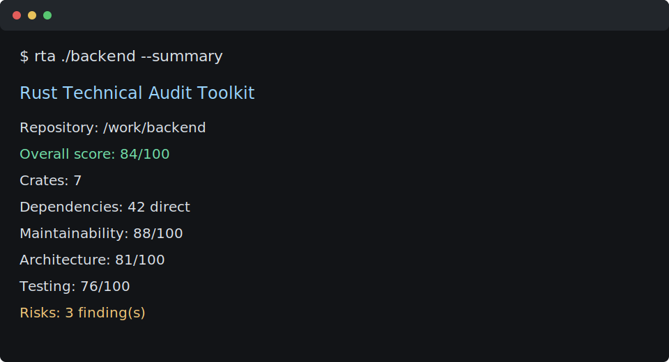

# Rust Technical Audit Toolkit

Rust Technical Audit Toolkit (`rta`) is a CLI-first technical due diligence tool for Rust codebases.

It helps CTOs, founders, investors, engineering managers, and consulting engineers form a fast, structured view of repository health before deeper manual review.

This is not a security scanner. It is not a linter. It is an engineering assessment platform focused on architecture, maintainability, dependency posture, testing maturity, and delivery risk.



## What It Analyzes

| Area | Signals |
| --- | --- |
| Repository overview | Crates, packages, workspace members, project size, language mix, Cargo manifests |
| Dependency analysis | Direct dependencies, critical dependencies, broad or non-registry declarations, maintenance indicators |
| Code quality | Lines of Rust code, module count, function count, average function size, large modules, God module candidates |
| Architecture review | Layer vocabulary, domain boundaries, modularity, circular dependency risk indicators |
| Engineering risk | Bus factor concerns, single points of failure, complex modules, lack of tests, dependency concentration |
| Testing maturity | Unit test presence, integration tests, test function count, testing structure |

## Install

```bash
cargo install --path crates/audit-cli
```

For local development:

```bash
cargo run -p rta -- examples/sample-rust-service --summary
```

## CLI Usage

```bash
rta [PATH] [--markdown|--json|--summary] [--output FILE]
```

Examples:

```bash
rta . --summary
rta ./service --json
rta ./service --markdown --output audit-report.md
```

## Output Formats

`--summary` prints a compact executive snapshot for triage.

`--json` emits machine-readable output for dashboards, pipelines, or consulting portals.

`--markdown` generates a professional due diligence report with:

- Executive Summary
- Architecture
- Dependency Health
- Code Quality
- Testing
- Risks
- Recommendations
- Overall Score

See [docs/sample-report.md](docs/sample-report.md) for an example.

## Scoring Model

The first scoring model is intentionally transparent:

| Area | Weight |
| --- | ---: |
| Dependency Health | 20% |
| Code Quality | 25% |
| Architecture | 25% |
| Testing | 15% |
| Risk Posture | 15% |

Scores are heuristic indicators, not absolute judgments. The tool is designed to make senior review faster by surfacing where manual diligence should focus.

## Architecture

The workspace is split into:

- `crates/audit-core`: collection, analyzers, scoring, JSON rendering, Markdown rendering
- `crates/audit-cli`: CLI argument handling and command execution
- `examples/sample-rust-service`: small fixture repository for demos and regression checks

Analyzer modules implement a shared trait and consume a `RepositorySnapshot`. This keeps rules extensible and avoids coupling the CLI to assessment logic.

## Roadmap

- Parser-backed Rust syntax analysis
- Cargo metadata integration
- Optional `cargo outdated` integration
- Trend comparison between audit runs
- HTML report output
- Rule severity configuration
- Repository ownership and contributor analysis

## License

Licensed under either of:

- Apache License, Version 2.0
- MIT license
